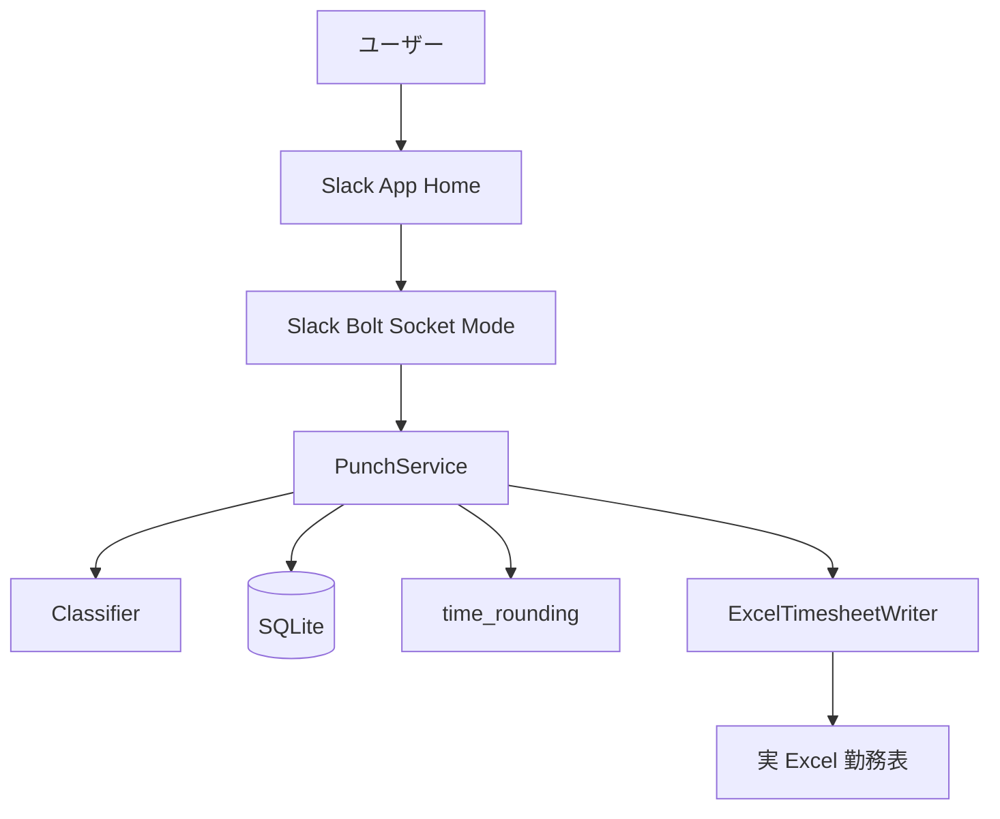

# 実 Excel 検証 設計

## 1. 方針

既存の v1 実装を前提に、実勤務表へ反映するための設定、検証手順、失敗時の確認観点を定義する。

当初の主目的は `excel_writer.py` が実勤務表の構造に対して期待どおり動くことの実機確認だった。検証と運用調整の結果、後追いメモ反映、時刻丸め、Slack UI からの丸め単位選択、SQLite 設定保存、手動編集の空欄保持を追加したため、この設計にも現状仕様を反映する。

## 2. 影響範囲

| 領域 | 対象 | 影響 |
| --- | --- | --- |
| 設定 | `config/config.local.json` | 実勤務表パス、シート、列、行範囲を設定する |
| Excel 書き込み | `src/tapinshift/excel_writer.py` | 実 Excel での開封、行探索、セル書き込みを確認する |
| 業務フロー | `src/tapinshift/service.py` | 成功、確認待ち、失敗時の状態保存を確認する |
| Slack UI | `src/tapinshift/slack_app.py` | App Home、ボタン、丸め単位選択、日付編集モーダルの実操作を確認する |
| 保存 | `src/tapinshift/storage.py` | 打刻イベント、手動編集履歴、UI で変更したアプリ設定が保存されることを確認する |
| ドキュメント | `.steering/20260621-real-excel-validation/` | 検証意図とタスクを記録する |

## 3. 実行構成



## 4. 設定設計

`config/config.example.json` の既定マッピングは実勤務表向けの値を持っているため、実機では `config/config.local.json` に次を設定する。

| 設定 | 値 |
| --- | --- |
| `excel.path` | Git 管理対象外の実勤務表パス |
| `excel.sheet_name` | `6` |
| `excel.first_data_row` | `7` |
| `excel.last_data_row` | `37` |
| `excel.date_format` | `%Y-%m-%d` |
| `excel.columns.clock_in` | `F` |
| `excel.columns.clock_out` | `G` |
| `excel.columns.date` | `L` |
| `excel.columns.notice` | `W` |
| `excel.columns.expense_item` | `Y` |
| `excel.columns.amount` | `AB` |
| `time_rounding.mode` | 初期値。既定は `none` |
| `time_rounding.clock_in_direction` | 既定は `ceil` |
| `time_rounding.clock_out_direction` | 既定は `floor` |

秘密情報は設定ファイルへ書かず、環境変数で渡す。

検証時の `excel.path` は原本ではなく検証用コピーを指す。原本で確認する必要がある場合は、事前に復元可能なバックアップを作成してから実行する。

Slack App Home で変更した丸め単位は SQLite の `app_settings` に保存し、`config/config.local.json` の `time_rounding.mode` より優先する。

## 5. 書き込み設計

### 5.1 打刻

`ExcelTimesheetWriter.write_punch()` は次の順序で動く。

1. xlwings で Excel アプリを非表示起動する。
2. パスワード付き勤務表を開く。
3. シート `6` を取得する。
4. `L` 列から対象日を探す。
5. 既定値 `B=1`, `C=1`, `D=0`, `E=0` を空欄の場合のみ書く。
6. 出勤なら `F`、退勤なら `G` へ時刻を書く。
7. 保存して閉じる。

打刻では任意メモ分類を行わず、`W`, `Y`, `AB` は変更しない。既存の出勤・退勤セルを上書きしない。既存値がある場合は例外にし、サービス層で `failed` として保存する。

### 5.2 手動編集

`ExcelTimesheetWriter.update_day()` は対象日の `F`, `G`, `W`, `Y`, `AB` を上書きする。手動編集は復旧用途を兼ねるため、打刻と異なり既存値の上書きを許可する。

編集モーダルで空欄のまま送信した項目は `None` として扱い、既存 Excel セルを保持する。セルを消す操作は Excel 上で直接行う。

### 5.3 丸め単位

`PunchService.handle_punch()` は、SQLite の `app_settings` に保存された `time_rounding.mode` を優先して打刻時刻を丸める。保存値がない場合は `config/config.local.json` の `time_rounding.mode` を使う。

対応する丸め単位は `none`, `5m`, `10m`, `15m`, `20m`, `30m`。丸め方向は出勤が `clock_in_direction`、退勤が `clock_out_direction` を使う。

## 6. 検証設計

### 6.1 自動テスト

devcontainer では実 Excel アプリがないため、既存の unittest を品質確認として実行する。

```bash
PYTHONPATH=src python3 -m unittest discover -s tests
```

### 6.2 設定診断

実機では、仮想環境を作成してプロジェクトをインストールしてから次を実行する。

```bash
python3 -m venv .venv
. .venv/bin/activate
pip install -e .
```

Windows PowerShell の場合は次のように有効化する。

```powershell
python -m venv .venv
.\.venv\Scripts\Activate.ps1
pip install -e .
```

その後、設定診断を実行する。

```bash
tapinshift-agent --config config/config.local.json --check-config
```

未設定の環境変数がある場合は `MISSING` が出てもよい。意図した不足だけが表示されることを確認する。

### 6.3 実機確認

実機確認では次を確認する。

| ケース | 期待結果 |
| --- | --- |
| App Home 表示 | 任意メモ、出勤、退勤、メモ反映、日付選択、丸め単位選択が表示される |
| 丸め単位選択 | 選択値が SQLite に保存され、以降の出勤・退勤に適用される |
| 出勤 | 対象日の `F` 列へ時刻が入る |
| 退勤 | 対象日の `G` 列へ時刻が入る |
| メモ反映 | 明確な分類結果だけ `W`, `Y`, `AB` へ反映される |
| 既存セル打刻 | 上書きせず `failed` として SQLite に残る |
| 手動編集 | 入力した `F`, `G`, `W`, `Y`, `AB` を上書きでき、空欄項目は既存値を保持する |
| 対象日なし | Excel を保存せず、失敗として SQLite に残る |

メモ分類の検証では、合否判断を固定するために入力例と期待値を記録してから実行する。分類はローカルルールで行う。

## 7. リスクと対応

| リスク | 対応 |
| --- | --- |
| 実勤務表の日付セル形式が想定と違う | `matches_target_date()` と `_find_row()` の挙動を確認し、必要なら対応形式を追加する |
| Excel ファイルが開かれていて保存できない | 失敗として SQLite に保存し、手動復旧する |
| パスワード未設定 | `--check-config` で検知する |
| xlwings が実機に未導入 | 実機セットアップ手順で検知する |
| Slack token 権限不足 | App Home 表示とモーダル表示の時点で検知する |
| 原本の勤務表を壊す | 検証用コピーまたは事前バックアップを必須にする |

## 8. 永続ドキュメントへの影響

今回の作業で、後追いメモ反映、時刻丸め方向、Slack UI からの丸め単位選択、SQLite `app_settings`、手動編集の空欄保持を実装したため、対応する `docs/` も更新する。
