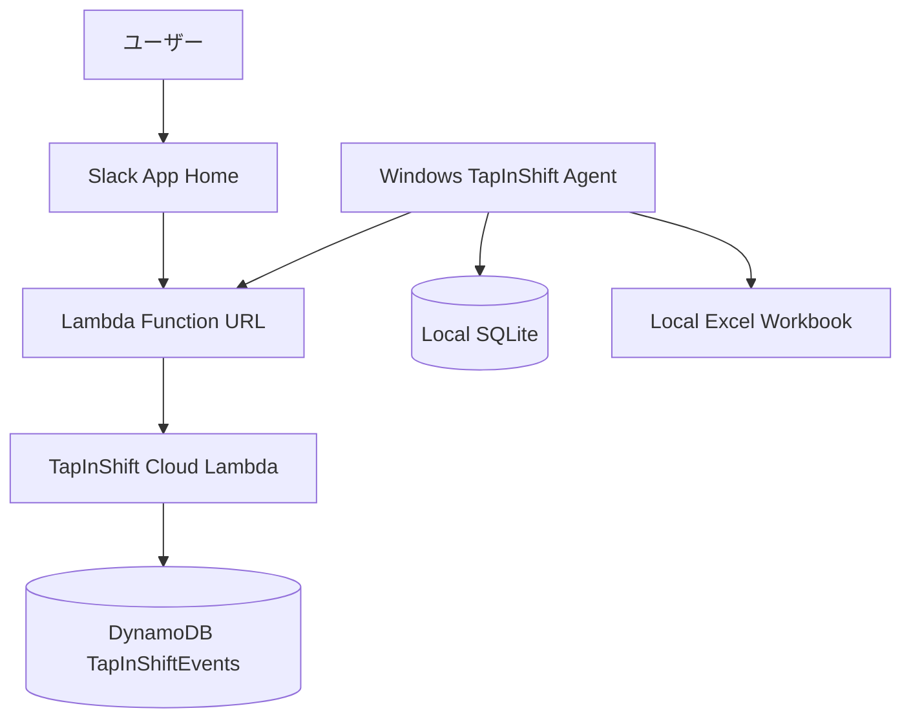

# クラウドキュー同期 設計

## 1. 方針

TapInShift を、ローカル PC 起動中だけ Slack 操作を処理する構成から、Slack 受付と Excel 反映を分離した構成へ拡張する。

クラウド側は AWS Lambda Function URL と DynamoDB で Slack 操作を受け付ける。Windows Agent はクラウド API を定期ポーリングし、claim できたイベントだけを既存の Excel 書き込み処理へ渡す。

月額コスト最小を優先し、常時起動 Web サーバーやマネージド RDB は使わない。

## 2. 実行構成



## 3. コンポーネント責務

| コンポーネント | 責務 |
| --- | --- |
| Cloud Lambda | Slack HTTP 受付、署名検証、App Home 生成、丸め、分類、DynamoDB 保存、同期 API |
| DynamoDB | イベント、同期状態、ユーザー設定の保存 |
| Windows Agent | 定期ポーリング、claim 済みイベント取得、Excel 反映、ローカル SQLite 記録、同期結果返却 |
| Local SQLite | Excel 反映試行とローカルエラーの監査ログ |
| Excel writer | 既存勤務表への実書き込み、既存セル上書き防止、日別編集反映 |

## 4. Slack 受付設計

Slack App は HTTP Request URL 方式へ移行する。

- Request URL は Lambda Function URL を使う。
- Slack からのリクエストは `X-Slack-Signature` と `X-Slack-Request-Timestamp` を検証する。
- App Home 表示、ボタン操作、select 操作、モーダル送信はクラウド側で処理する。
- Windows Agent は Slack と直接接続しない。

## 5. 認証設計

| 通信 | 認証方式 |
| --- | --- |
| Slack -> Cloud Lambda | Slack Signing Secret による署名検証 |
| Windows Agent -> Cloud Lambda | `Authorization: Bearer <TAPINSHIFT_SYNC_TOKEN>` |

秘密情報は環境変数で管理する。

| 環境 | 秘密情報 |
| --- | --- |
| AWS Lambda | Slack Signing Secret、同期 API token |
| Windows Agent | 同期 API token、Excel password、ローカル設定 |

## 6. DynamoDB 設計

単一テーブル `TapInShiftEvents` を使う。

### 6.1 キー設計

```text
PK = USER#<slack_user_id>
SK = EVENT#<target_date>#<created_at>#<event_id>
```

未同期取得用に GSI を用意する。

```text
GSI1PK = SYNC#<sync_status>
GSI1SK = <created_at>
```

ユーザー設定も同じテーブルに保存する。

```text
PK = USER#<slack_user_id>
SK = SETTING#time_rounding.mode
value = 30m
updated_at = ...
```

### 6.2 イベント属性

```text
event_id
event_type: punch | note_reflection | day_edit
slack_user_id
target_date
sync_status: queued | claimed | reflected | failed
claim_token
claimed_at
retryable
error
created_at
updated_at
```

出退勤イベント:

```text
punch_type: clock_in | clock_out
tapped_at
reflected_at
rounding_mode
rounding_direction
duplicate_warning
```

メモ反映イベント:

```text
raw_note
notice
expense_item
amount
confidence
needs_confirmation
```

日別編集イベント:

```text
clock_in
clock_out
notice
expense_item
amount
```

日別編集で属性が存在しない、または空欄として送られた項目は、Windows Agent 側で `None` として扱い、既存 Excel 値を保持する。

## 7. 同期状態設計

状態遷移:

```text
queued
  -> claimed
      -> reflected
      -> failed
```

Windows Agent は `queued` を直接処理しない。同期 API の claim 処理で `claimed` に変更できたイベントだけを処理する。

`claimed` のまま一定時間更新されないイベントは、再同期対象へ戻せるようにする。

```text
claimed かつ claimed_at が期限切れ
  -> queued
```

## 8. 丸め設計

出勤/退勤の打刻時刻は、Slack ボタンを押した時点でクラウド側が `tapped_at` として確定する。

クラウド側で丸め処理を実行し、Excel に反映する時刻を `reflected_at` として保存する。

- `tapped_at`: 実際に Slack 操作を受け付けた時刻。
- `reflected_at`: 丸め後の Excel 反映時刻。
- `rounding_mode`: `none`, `5m`, `10m`, `15m`, `20m`, `30m`。
- `rounding_direction`: 出勤は設定された出勤方向、退勤は設定された退勤方向。

Windows Agent は同期時に丸め計算をやり直さず、保存済みの `reflected_at` を Excel へ書き込む。

## 9. 任意メモ分類設計

任意メモ分類はクラウド側で実行し、分類結果を保存する。

クラウドとローカルで分類ロジックが分岐しないよう、既存のローカルルール分類は共通モジュールとして再利用できる形に整理する。

分類できない、または確認が必要なメモは `needs_confirmation` として保存し、Excel 同期対象にするかどうかは実装時に明確化する。初期方針は、確認待ちを Excel へ自動反映しない。

## 10. 日別編集設計

`day_edit` は明示的な上書き操作として扱う。

- 入力された項目は Excel へ上書きする。
- 空欄の項目は既存 Excel 値を保持する。
- セルを消したい場合は Excel 上で直接消す。

この方針は現在の編集モーダル仕様と一致する。

## 11. 二重打刻設計

クラウド側では、同日同種の出勤/退勤が既に存在する場合でもイベントを保存する。ただし Slack には警告を表示する。

最終的な上書き防止は Windows Agent の Excel 反映時にも維持する。Excel の出勤/退勤セルに既存値がある場合は上書きせず、同期結果を失敗として記録する。

## 12. Windows Agent 同期設計

Windows Agent は次のタイミングで同期する。

- 起動直後に 1 回。
- 起動中は 5 分ごと。
- 手動同期コマンド実行時。

同期処理:

1. 同期 API に Bearer token 付きで claim 要求を送る。
2. claim できたイベントを取得する。
3. イベント種別に応じて既存の Excel writer へ渡す。
4. ローカル SQLite に反映試行を記録する。
5. 成功または失敗をクラウド API へ返す。

## 13. 失敗処理

失敗理由に応じて自動リトライ可否を分ける。

自動リトライ候補:

- Excel ファイルが一時的に開けない。
- 保存時の一時エラー。
- COM セッション切断。
- ネットワーク一時エラー。

自動リトライしない候補:

- 既存セルに値がある。
- 対象日が勤務表に存在しない。
- 入力値が不正。
- Excel password 未設定。

## 14. App Home 表示設計

初期表示は最小限にする。

表示する:

- 最新ステータスメッセージ。
- 未同期件数。
- 直近の受付結果。
- 丸め単位。
- 出勤、退勤、メモ反映、日付編集の操作 UI。

表示しない:

- 日別の全履歴。
- 詳細な失敗一覧。
- 再同期ボタン。
- ローカル Excel 側の詳細エラー全文。

## 15. 段階移行

既存のローカル方式を即時削除しない。

1. 既存ローカル方式を残す。
2. AWS Lambda + DynamoDB のキューを追加する。
3. Windows Agent に `sync-now` と 5 分ポーリングを追加する。
4. クラウド上のテストイベントを Excel に反映できることを確認する。
5. Slack App Home をクラウド側に移す。
6. 安定後にローカル Socket Mode を廃止候補にする。

## 16. 永続ドキュメントへの影響

この変更は TapInShift の基本構成に影響するため、実装時には `docs/product-requirements.md`、`docs/functional-design.md`、`docs/architecture.md`、`docs/glossary.md` を更新する。
