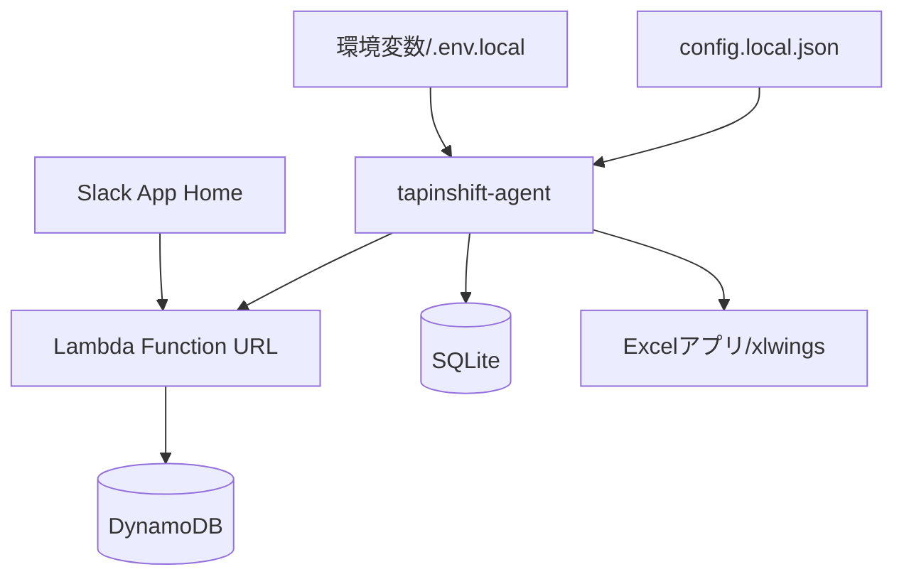
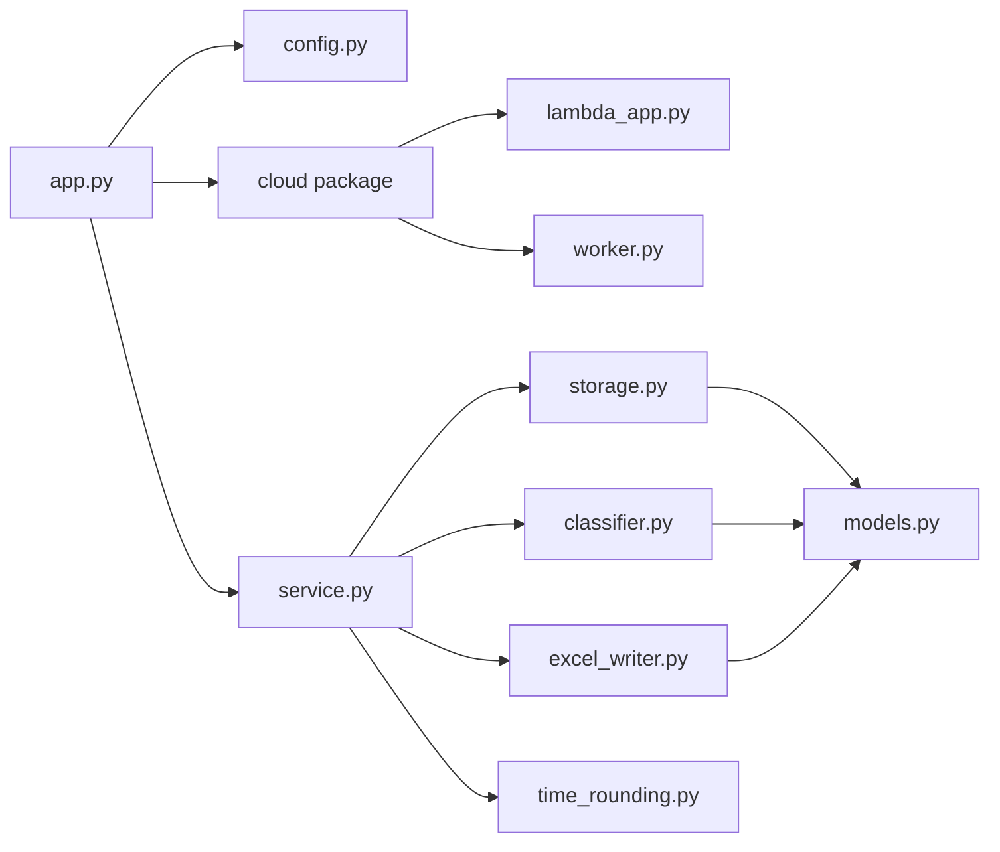

# TapInShift 技術仕様書

## 1. 技術概要

TapInShift は Slack App Home、AWS Lambda Function URL、DynamoDB、Windows同期エージェントで構成する勤怠入力ツールである。Slack操作はクラウドキューに保存し、Windows Agent が起動後に xlwings 経由でローカル Excel 勤務表へ反映する。

ExcelファイルとExcel password はローカル端末に閉じ、クラウドには最小限のイベントデータと同期状態だけを置く。

## 2. テクノロジースタック

| 領域 | 採用技術 |
| --- | --- |
| 言語 | Python 3.11 以上 |
| Slack 連携 | Slack HTTP Request URL, Slack Web API |
| クラウド受付 | AWS Lambda Function URL |
| クラウド保存 | DynamoDB |
| 設定 | JSON, python-dotenv, 環境変数 |
| 監査ログ | SQLite |
| 任意メモ分類 | ローカルルール |
| Excel 操作 | xlwings |
| テスト | unittest |
| パッケージ管理 | pyproject.toml, setuptools |

## 3. 実行構成



## 4. 実行環境

### 4.1 開発環境

- Linux devcontainer でも単体テストと設定診断は実行できる。
- 実 Excel 書き込みは Excel アプリが必要なため、Windows または macOS のローカル実機で検証する。
- Python 仮想環境は `.venv/` を使用する。

### 4.2 実運用環境

- Python 3.11 以上。
- Slack App の HTTP Request URL と Interactivity が利用できること。
- AWS Lambda Function URL と DynamoDB が利用できること。
- Excel アプリがインストールされていること。
- 勤務表 Excel ファイルへローカルファイルとしてアクセスできること。
- パスワード付き Excel を xlwings で開けること。

## 5. 設定仕様

設定ファイルは JSON 形式とし、既定パスは `config/config.local.json` とする。

主な設定項目:

| 項目 | 内容 |
| --- | --- |
| `timezone` | 打刻時刻のタイムゾーン |
| `database_path` | SQLite ファイルパス |
| `excel.path` | 勤務表 Excel ファイルパス |
| `excel.sheet_name` | 対象シート名 |
| `excel.columns` | Excel 列定義 |
| `excel.first_data_row` | データ開始行 |
| `excel.last_data_row` | データ終了行 |
| `excel.date_format` | 日付照合フォーマット |
| `excel.defaults` | 空セルに入れる既定値 |
| `time_rounding` | 時刻丸め設定 |
| `slack` | Slack token の環境変数名 |
| `cloud_sync` | クラウド同期エンドポイント、token、ポーリング間隔 |

`time_rounding.mode` は起動時の初期値である。Slack App Home で丸め単位を変更した場合、SQLite の `app_settings` に保存された値が以降の打刻で優先される。

## 6. 秘密情報

秘密情報は設定ファイルに直接保存しない。

| 環境変数 | 用途 |
| --- | --- |
| `SLACK_BOT_TOKEN` | Slack Bot Token |
| `SLACK_SIGNING_SECRET` | Slack 署名検証 |
| `TAPINSHIFT_SYNC_TOKEN` | Windows Agent 同期 API token |
| `TAPINSHIFT_CLOUD_ENDPOINT` | Lambda Function URL |
| `TAPINSHIFT_EXCEL_PASSWORD` | Excel 開封パスワード |

`.env.local` を使う場合も Git 管理対象外にする。

## 7. モジュール境界



### 境界ルール

- Slack 固有の payload 処理は `slack_app.py` に閉じる。
- クラウドHTTP受付と同期処理は `tapinshift.cloud` に閉じる。
- 業務判断は `service.py` に集約する。
- Excel 操作は `excel_writer.py` に閉じる。
- SQLite 操作は `storage.py` に閉じる。
- 任意メモ分類は `classifier.py` に閉じる。

## 8. 技術的制約

- Slack受付はクラウドで行うが、Excel反映はWindows Agent起動中のみ行う。
- xlwings は Excel アプリに依存するため、CI や devcontainer では実 Excel 書き込みを保証しない。
- Excel ファイルをユーザーが開いている場合、保存失敗や競合が発生する可能性がある。
- 任意メモ分類はローカルルールに依存するため、自由文の分類精度には限界がある。

## 9. パフォーマンス要件

- 想定利用は単一ユーザーまたは小規模利用。
- 打刻 1 件ごとに Excel ファイルを開き、保存し、閉じる。
- 大量同時打刻や高頻度バッチ処理は対象外。
- Slack の ack は即時に返し、ユーザーには App Home 更新で結果を表示する。

## 10. 可用性・復旧

- Excel 反映に失敗しても打刻イベントは SQLite に保存する。
- 失敗内容は `error` として保存する。
- Slack UI で変更した丸め単位は DynamoDB に保存し、以降のクラウド受付打刻へ適用する。
- Windows Agent は `queued` イベントを `claimed` にしてから処理し、成功時は `reflected`、失敗時は `failed` をクラウドへ返す。
- 手動編集で Excel を上書きして復旧する。
- v1 では自動リトライは実装しない。

## 11. セキュリティ要件

- token、API key、Excel password をログやドキュメントへ出力しない。
- `config.local.json`、`.env.local`、`data/` は Git 管理対象外にする。
- Slack ユーザー入力は文字列として受け取り、Excel 書き込み前に型変換する。
- 金額は整数に変換できる場合のみ Excel へ渡す。
- `scripts/timesheet_tools.py show-db` は `app_settings` の全キーを表示せず、表示許可した運用設定のみ出力する。
- Excel password 環境変数が未設定の場合、Excel writer は Excel を開く前に停止する。

## 12. 品質確認

### 基本コマンド

```bash
.venv/bin/python -m unittest discover -s tests
.venv/bin/tapinshift-agent --config config/config.local.json --check-config
```

### 実機確認

```bash
.venv/bin/tapinshift-agent --config config/config.local.json
```

実機確認では Slack App Home 表示、丸め単位選択、出勤、退勤、日付編集、Excel 反映、失敗時ログ保存を確認する。
