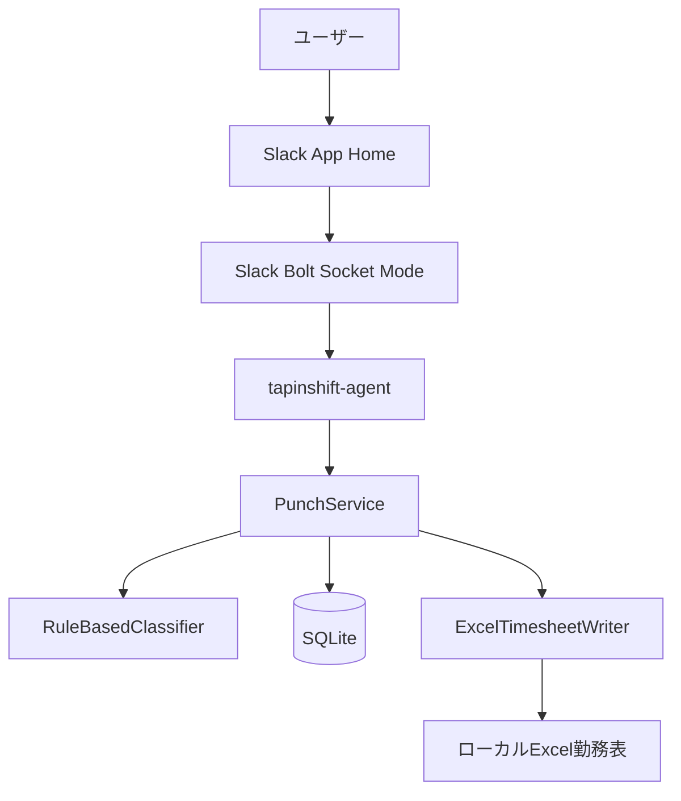
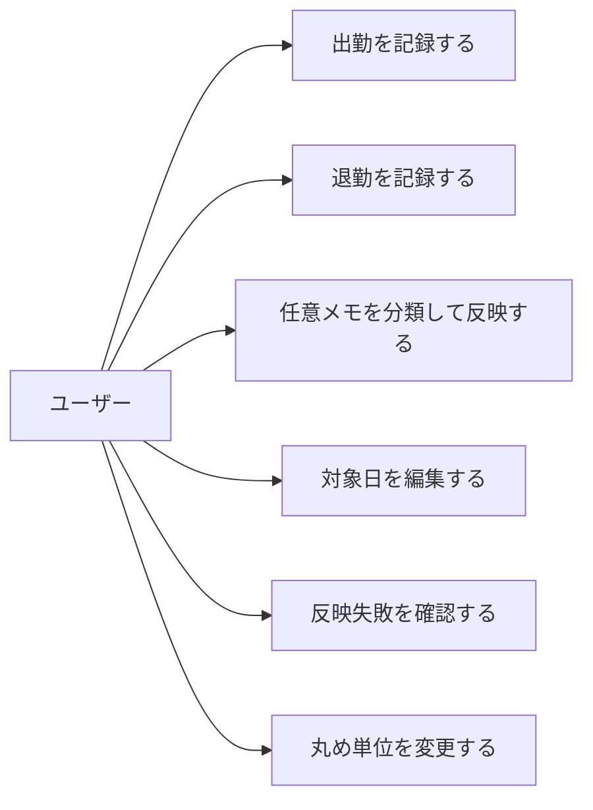
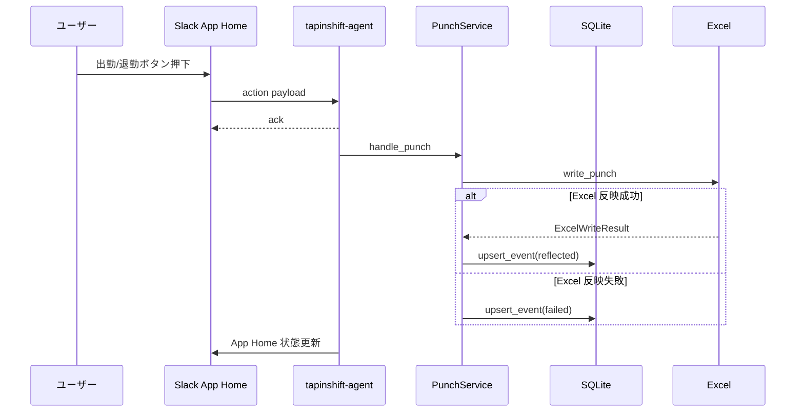
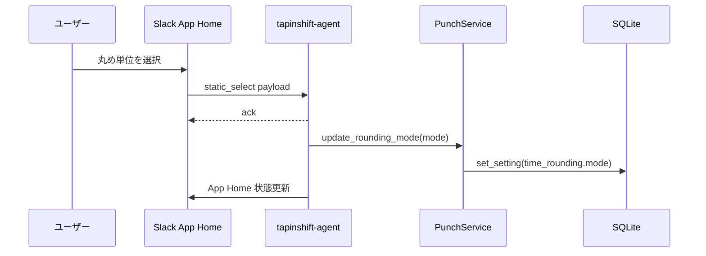
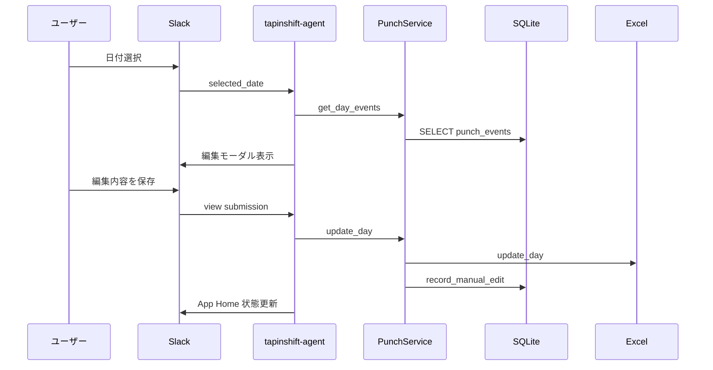
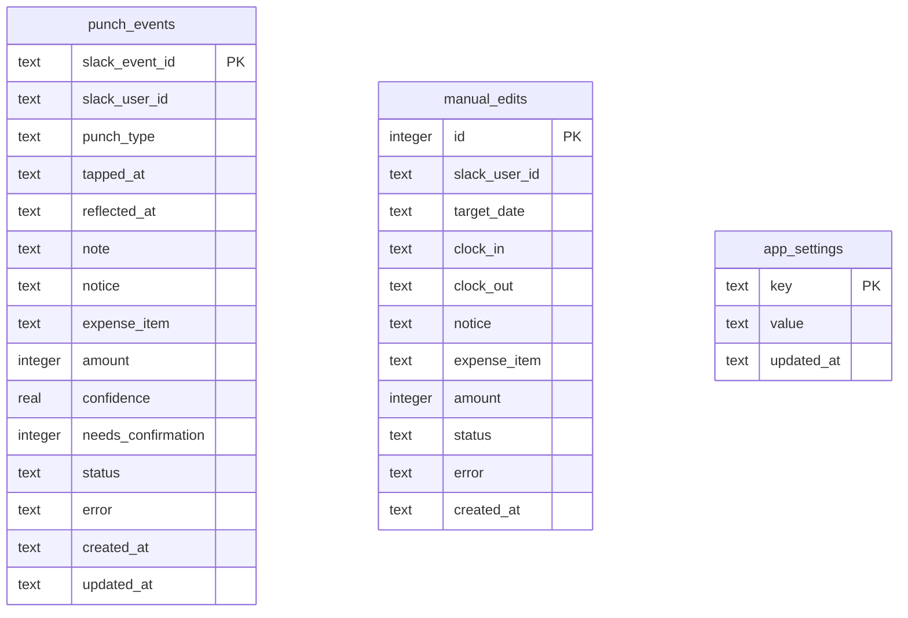

# TapInShift 機能設計書

## 1. 目的

この文書は TapInShift の機能構成、データ構造、画面、処理フローを定義する。

TapInShift は Slack App Home を入力画面とし、Python ローカルエージェントが SQLite に監査ログを保存しながら、ローカル Excel 勤務表へ出勤・退勤・届出・経費情報を反映する。

## 2. システム構成



## 3. 機能一覧

| 機能 | 概要 | 主な実装 |
| --- | --- | --- |
| App Home 表示 | Slack App Home に入力 UI を表示する | `slack_app.py` |
| 出勤打刻 | 出勤ボタンで時刻を記録し Excel へ反映する | `slack_app.py`, `service.py`, `excel_writer.py` |
| 退勤打刻 | 退勤ボタンで時刻を記録し Excel へ反映する | `slack_app.py`, `service.py`, `excel_writer.py` |
| 任意メモ分類 | メモから届出・経費・金額を分類する | `classifier.py` |
| 日別編集 | 日付選択から編集モーダルを開き、対象日を上書きする | `slack_app.py`, `service.py` |
| 監査ログ | 打刻と手動編集の履歴を SQLite に保存する | `storage.py` |
| 丸め単位変更 | App Home で選択した丸め単位を保存し、以降の打刻へ適用する | `slack_app.py`, `service.py`, `storage.py` |
| 設定診断 | 起動前に環境変数、Excel、依存関係を確認する | `app.py` |

## 4. ユースケース



## 5. 主要フロー

### 5.1 出勤・退勤フロー



### 5.2 丸め単位変更フロー



### 5.3 日別編集フロー



## 6. コンポーネント設計

### 6.1 `app.py`

- CLI エントリポイント。
- `.env.local` を読み込む。
- JSON 設定を `AppConfig` に変換する。
- `--check-config` で起動前診断を行う。
- `SocketModeHandler` で Slack と接続する。

### 6.2 `config.py`

- JSON 設定ファイルを読み込む。
- Excel、Slack、時刻丸め、SQLite の設定を dataclass で保持する。
- `time_rounding.mode` は設定ファイル上の初期値として扱い、Slack UI で変更された丸め単位は SQLite の `app_settings` が優先される。
- 秘密情報は環境変数名だけを設定ファイルに持ち、値は実行時に環境変数から取得する。

### 6.3 `slack_app.py`

- Slack Bolt App を構築する。
- App Home、ボタンアクション、日付選択、編集モーダル送信を処理する。
- 丸め単位の `static_select` を表示し、選択変更を `PunchService` に委譲する。
- 出勤・退勤ボタンは任意メモ欄を送信せず、メモ分類は `メモ反映` ボタンでのみ実行する。
- Slack UI は Block Kit のみで構成する。
- ビジネスロジックは `PunchService` に委譲する。

### 6.4 `service.py`

- 打刻と編集のアプリケーションサービス。
- 打刻では現在時刻取得、時刻丸め、Excel 書き込み、SQLite 保存を統合する。
- 任意メモ分類は、後追いメモ反映時にだけ実行する。
- 丸め単位は `EventStore.get_setting("time_rounding.mode")` を優先し、未設定時は `AppConfig.time_rounding.mode` を使う。
- Excel 反映失敗時も SQLite に状態とエラーを保存する。

### 6.5 `classifier.py`

- 任意メモの分類を担当する。
- キーワードと正規表現によるローカルルール分類を行う。

### 6.6 `excel_writer.py`

- xlwings で Excel アプリを起動し、指定ファイルを開く。
- 対象日付の行を検索する。
- 打刻時は既存の出勤・退勤セルを上書きしない。
- 手動編集時は指定された値で上書きする。

### 6.7 `storage.py`

- SQLite の初期化と読み書きを担当する。
- 打刻イベントは `slack_event_id` を主キーとして upsert する。
- 手動編集は追記履歴として保存する。
- UI で変更したアプリ設定は `app_settings` に key-value で保存する。

## 7. データモデル

### 7.1 ドメインモデル

| モデル | 内容 |
| --- | --- |
| `PunchType` | `clock_in`, `clock_out` |
| `ReflectionStatus` | `pending`, `reflected`, `failed`, `needs_confirmation` |
| `Classification` | 届出内容、経費内容、金額、信頼度、確認要否 |
| `PunchEvent` | Slack イベント、ユーザー、打刻種別、時刻、分類、状態、エラー |

### 7.2 ER 図



## 8. Slack 画面設計

### 8.1 App Home

```text
+----------------------------------+
| 状態メッセージ                    |
+----------------------------------+
| 任意メモ                          |
| [渋谷オフィス 新宿駅-渋谷駅 1200円] |
+----------------------------------+
| [出勤] [退勤] [メモ反映]           |
+----------------------------------+
| 表示・編集する日付                 |
| [yyyy-mm-dd]                      |
+----------------------------------+
| 丸め単位                          |
| [丸めなし / 5分 / 10分 / ...]      |
+----------------------------------+
```

任意メモは、届出内容と経費内容が同じ文に含まれる場合も分類結果を分離する。届出内容は勤務した拠点、建物名、駅名などの場所情報として扱う。経費内容は金額に対応する内容として扱い、交通費の場合は経路のみを入れる。例: `渋谷オフィス 新宿駅-渋谷駅 1200円` は `notice=渋谷オフィス`, `expense_item=新宿駅-渋谷駅`, `amount=1200` とする。

### 8.2 編集モーダル

```text
+----------------------------------+
| 勤務データ                        |
+----------------------------------+
| 対象日と記録済みイベント           |
| 出勤 [09:00]                      |
| 退勤 [18:00]                      |
| 届出内容 [渋谷オフィス]            |
| 経費内容 [新宿駅-渋谷駅]           |
| 金額 [320]                        |
| [保存] [閉じる]                   |
+----------------------------------+
```

金額表現は金額欄にのみ反映し、届出内容・経費内容からは除去する。

## 9. Excel 反映設計

### 9.1 行検索

- 設定の `excel.columns.date` 列を対象にする。
- `first_data_row` から `last_data_row` までを検索する。
- セル値を `date_format` で正規化し、対象日と一致する行を使う。

### 9.2 打刻時の書き込み

- 出勤は `clock_in` 列へ書く。
- 退勤は `clock_out` 列へ書く。
- 対象セルに既存値がある場合は上書きせず失敗にする。
- 任意メモ分類は行わず、届出内容、経費内容、金額は変更しない。

### 9.3 手動編集時の書き込み

- 出勤、退勤、届出内容、経費内容、金額を上書きする。
- 空欄は `None` として扱い、Excel 側の既存値を保持する。セルを消す操作は Excel 上で直接行う。
- 金額は整数へ変換する。変換できない場合は失敗として保存する。

## 10. API 設計

v1 は公開 HTTP API を持たない。外部連携は Slack Socket Mode のみである。

将来バックエンドを追加する場合は、次の境界を API 化候補とする。

- 打刻登録
- 日別イベント取得
- 日別勤務データ更新
- 未反映イベント再処理

## 11. エラー処理

| エラー | 処理 |
| --- | --- |
| Slack token 未設定 | 起動失敗、または `--check-config` で MISSING |
| Excel パスワード未設定 | `--check-config` で MISSING |
| Excel 対象日なし | 打刻または編集を failed として保存 |
| 既存セルあり | 打刻を failed として保存 |
| メモ分類が曖昧 | Excel 反映せず needs_confirmation として保存 |
| 金額入力不正 | 手動編集を failed として保存 |
